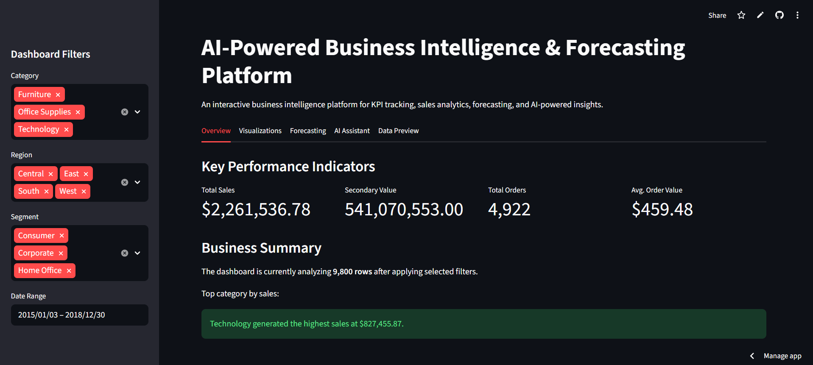

## Live Demo

[Launch Application](https://ai-business-intelligence-forecasting-platform-8evpi9ndjmto48ob.streamlit.app/)
# AI-Powered Business Intelligence & Forecasting Platform

An end-to-end analytics and forecasting platform built using Python, SQL workflows, machine learning, and interactive business intelligence dashboards.

## Features

- Interactive KPI dashboard with dynamic sidebar filters
- Category, region, segment, and date range filtering
- Machine learning forecasting using Scikit-learn
- AI-powered business intelligence assistant using OpenAI API
- Interactive Plotly visualizations
- Filtered dataset preview
- Streamlit deployment with live demo
- SQLite database integration for structured data storage
- SQL Explorer for custom business analytics queries

## Tech Stack

- Python
- Pandas
- Scikit-learn
- Streamlit
- Plotly
- SQL
- OpenAI API

## Project Goals

This project was designed to simulate a real-world business intelligence environment by combining analytics engineering, forecasting, dashboarding, and AI-driven insights into a single platform.

## Future Improvements

- SQL database integration
- AI-powered analytics chatbot
- Real-time API data ingestion
- Advanced forecasting models
- Cloud deployment
- User authentication system

## Dashboard Preview

